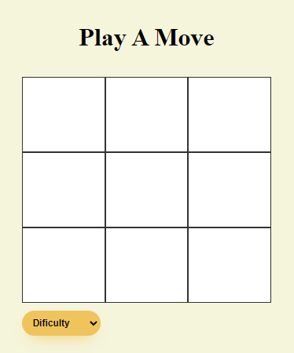

# TicTacToeProject

This project was generated with [Angular CLI](https://github.com/angular/angular-cli) version 16.1.8.

This web based Tic-Tac-Toe game allows you to play against a bot. You have the option of choosing a winnable or unbeatable difficulty (for those of you who want to channel your inner Matthew Broderick.)

To play, visit the website [Here](https://tic-tac-toe-gules-two.vercel.app/)
